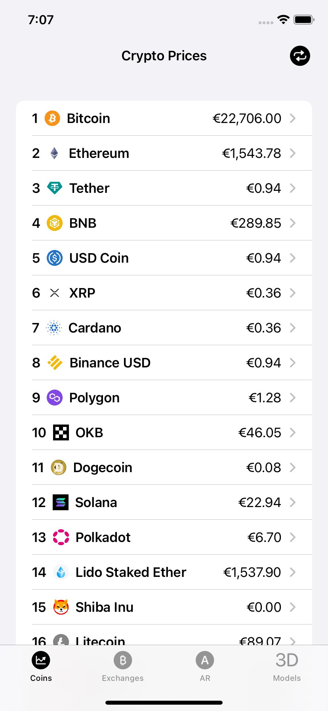
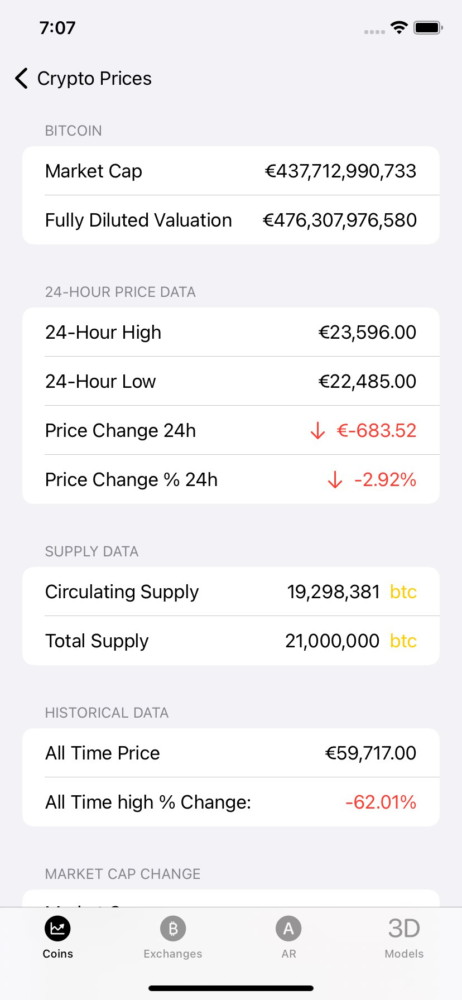
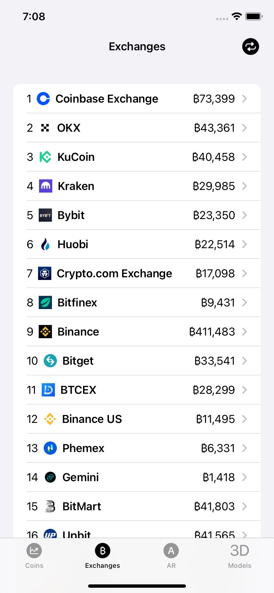
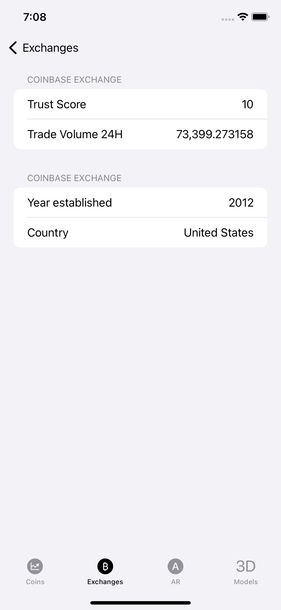

# CryptoAR
CryptoAR è un'app iOS che consente di tenere traccia delle criptovalute e visualizzare un modello 3D di Bitcoin in realtà aumentata. Il modello di Bitcoin e le altre componenti 3D in AR a lui collegate sono stati realizzati utilizzando Reality Composer. L'applicazione è collegata a due diversi API per accedere alle informazioni sulle criptovalute, una per le crypto e dun'altra per le exchanges.

# Funzionalità
Visualizza le informazioni attuali sulle criptovalute, come il prezzo e la capitalizzazione di mercato.
Consente di tenere traccia delle criptovalute preferite e di ricevere notifiche quando il prezzo raggiunge un certo livello.
Mostra un modello 3D di Bitcoin in realtà aumentata, con le informazioni sul prezzo e l'andamento del mercato aggiornate in tempo reale.
Utilizza Reality Composer per creare un modello di Bitcoin dettagliato e realistico.

# Requisiti
- iOS 13 o versioni successive.
- Connessione a Internet per accedere alle informazioni sulle criptovalute e alle API.
- Dispositivo iOS compatibile con la realtà aumentata.

#Descrizione
--------------
L’applicazione possiede un’UI facile ed intuitiva, ovvero una TabView suddivisa in diverse sezioni:
- **Coins**: Una ScrollView in cui sono presenti gli indici di mercato delle
singole criptovalute

</img>
</img>
  
  

- **Exchanges**: Una ScrollView in cui sono presenti gli indici di mercato
per l’exchange di criptovalute

</img>
</img>
  
  

- **AR**: Una UI in Agumented Reality in cui, utilizzando la fotocamera,
possiamo interagire con una criptovaluta in realtà virtuale sviluppata
con Reality Composer, implementata grazie a RealityKit e UIKit.

- **Models**: Una UI che sfrutta RealityKit, SceneKit e UIKit per rappresentare diversi modelli 3D di criptovalute con i quali è possibile interagire tramite touchscreen.
